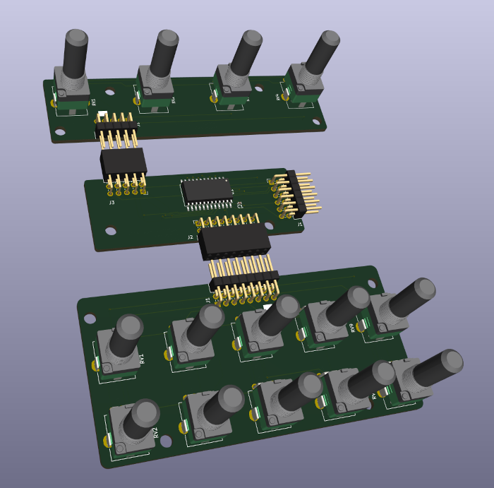
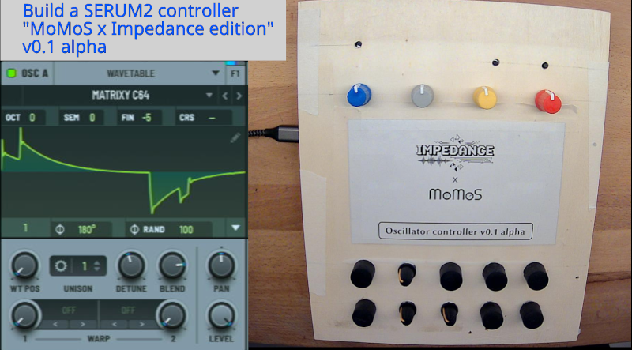
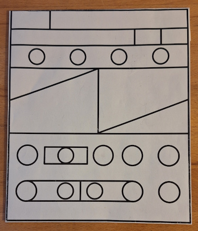
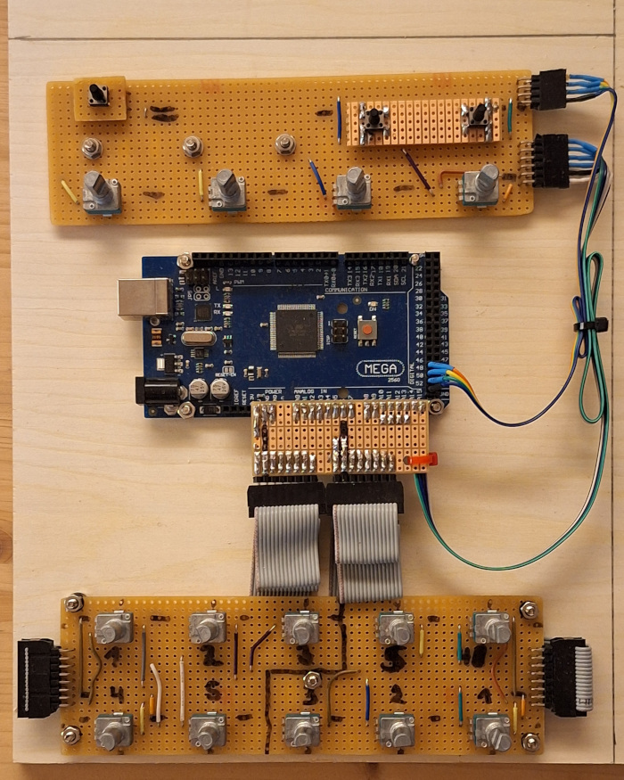

# Controllers

## Description
Controllers for MIDI, USB, Software Synths, VST Plugins. 

## Pictures
**PCB boards for the 14 knobs of S2-OSC:**

**Functional prototype of S2-OSC in a livestream:**

**Paper scribble for the S2-OSC frontplate:**

**Prototype in handmade PCB boards for S2-OSC:**

